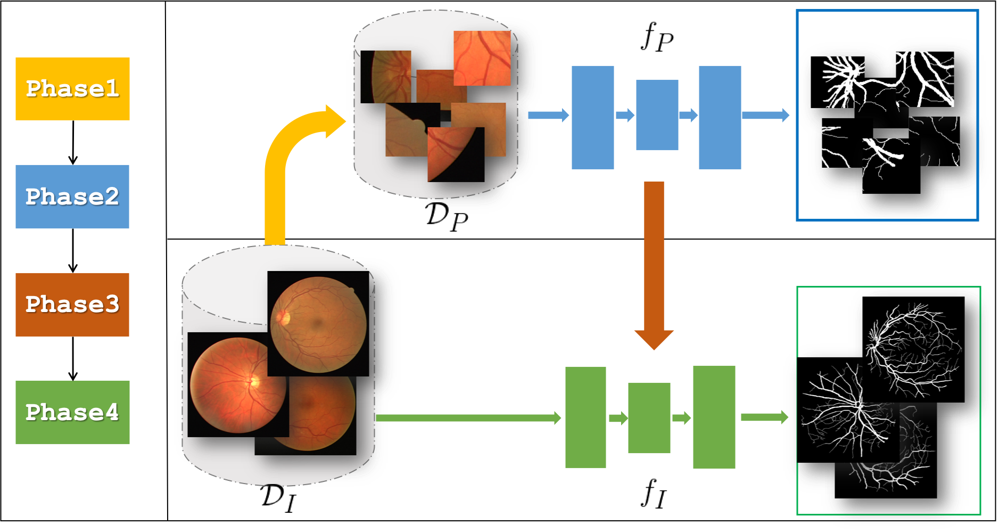

# Patch-to-Image Fully Convolutional Networks training for Retinal image segmentation

This repository contains the IPython code for the paper
> Taibou Birgui Sekou, Moncef Hidane, Julien Olivier and Hubert Cardot. [*From Patch to Image Segmentation using Fully Convolutional Networks - Application to Retinal Images*](https://arxiv.org/abs/1904.****). Submitted to Medical Image Analysis, 2019.

Given a retinal image database and a fully convolutional network (FCN) `f`, this tool first pre-trains it on an on-the-fly generated 
patch database, then fine-tunes it on the original full-sized images.

## Setup

**Environment**: One or more multi-GPU node(s) with the following software/libraries installed:
- [TensorFlow 1.12.0](https://tensorflow.org)
- [numpy 1.15.1](https://docs.scipy.org/doc/numpy/user/quickstart.html)  
- [h5py 2.7.0](http://docs.h5py.org/en/stable/build.html#install)
- [matplotlib 2.0.2](https://matplotlib.org/users/installing.html)
- [scikit-image 0.14.1](https://scikit-image.org)
- [scikit-learn *.19.1](https://scikit-learn.org)
 
**Datasets**: The following datasets are used in our experiments:
- [DRIVE](http://www.isi.uu.nl/Research/Databases/DRIVE/)
- [STARE](http://www.ces.clemson.edu/~ahoover/stare/)
- [CHASE_DB1](https://blogs.kingston.ac.uk/retinal/chasedb1/)
- [IDRiD](https://idrid.grand-challenge.org/)

**Data preprocessing**: All the images are preprocessed using:
- Gray scale conversion
- Gamma correction (with gamma=1.7)
- CLAHE normalization 
